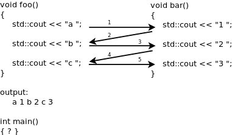

## Distinguishing fibers & coroutines

### Fiber 
- user level thread
- conceptually resemble kernel threads

### Coroutines

- when the invoker calls a coroutine, control immediately transfers into that coroutine; 
  when the coroutine yields, control immediately returns to its caller 
  (or, in the case of symmetric coroutines,to the designated next coroutine)
- coroutines do not resemble threads, more closely resembles an ordinary function,

The fiber library extends the coroutine library by **adding a scheduler and the aforementioned synchronization mechanisms.**

• a coroutine yields -> it passes control directly to its caller (or, in the case of symmetric coroutines, a designated
other coroutine).

• a fiber blocks -> it implicitly passes control to the fiber scheduler. Coroutines have no scheduler because they need no scheduler

[reference](http://www.open-std.org/jtc1/sc22/wg21/docs/papers/2014/n4024.pdf)
  
